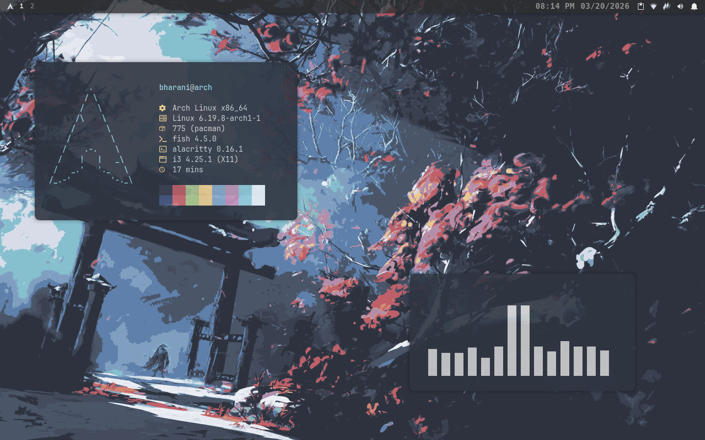
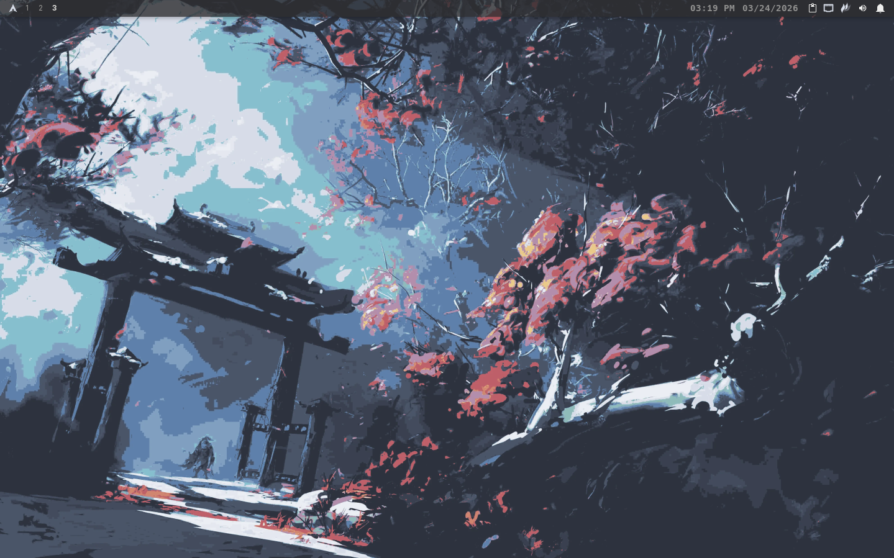
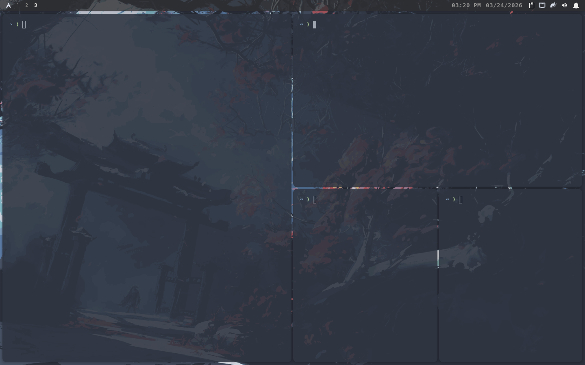
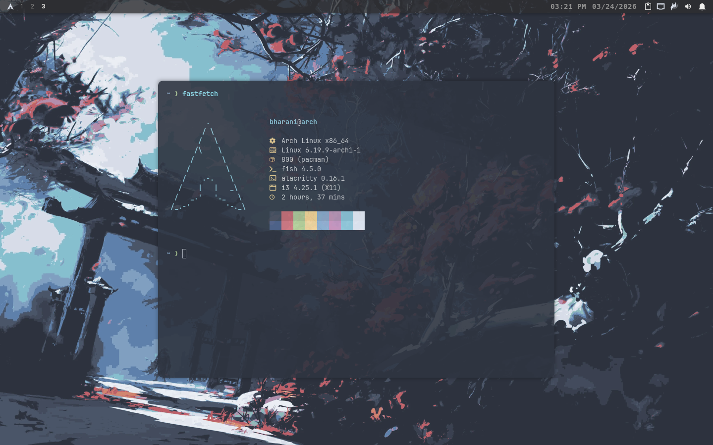
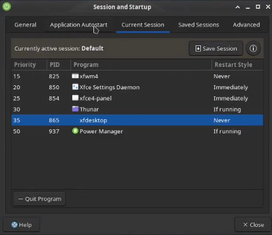
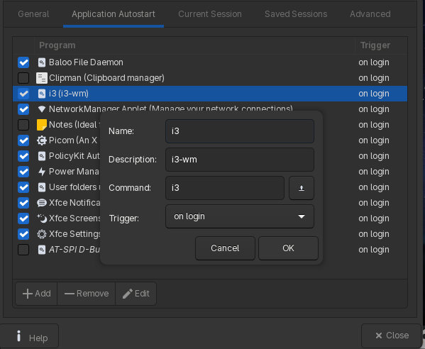

# Dotfiles
Dotfiles for Arch XFCE4 + i3-WM setup.
It's recommended to start with a fresh arch linux with XFCE4.

Previews:
<p align="center">
  <table>
    <tr>
      <td></td>
      <td></td>
    </tr>
    <tr>
      <td></td>
      <td></td>
    </tr>
  </table>
</p>

___
## Base system
### Download the essentials
```bash
sudo pacman -S --needed base-devel git i3 alacritty fastfetch fish picom rofi thunar autotiling feh rofimoji flameshot xfce4-whiskermenu-plugin xfce4-clipman-plugin xfce4-pulseaudio-plugin xfce4-notifyd xfce4-panel-profiles ttf-jetbrains-mono-nerd
```

You need AUR package helper to install this package, get it by:
```bash
git clone https://aur.archlinux.org/yay.git
```
```bash
cd yay
makepkg -si
```


```bash
yay -S i3ipc-glib-git
```

___
## Setup
### 1. Cloning the repo and copying config files
```bash
git clone https://github.com/BKYTamilan/Dotfiles.git
cd Dotfiles
```
> [!CAUTION]
> Backup your existing config files, this command will **OVERWRITE** the existing config folders.
```bash
cp -rf ~/Dotfiles/config/* ~/.config/
```


___
### 2. Setup XFCE4 + i3-wm
Go to **Settings Manager>Session and Startup>Current Session**.

Change **xfwm4** and **xfdesktop** from `immediatlety` to `never`.
<p align="center">
  
</p>

Go to **Settings Manager>Session and Startup>Application Autostart**

click on **+Add**. The name should be `i3`, description should be `i3-wm` and the command should be `i3`
<p align="center">
  
</p>

Reboot the system
```bash
reboot
```
> [!NOTE]
> You will need to log out and log back in (or reboot) for the change to take effect.

___
### 3. XFCE4 panel setup
Make sure you have `xfce4-panel-profiles` plugin installed

Right click the panel and choose **Panel Preference**. 

Click on **Backup and restore** at the top of the window.

Click on **Import** [Looks like a folder icon].

Go to **Home/Dotfiles/xfce4-panel** and select the archive file.

Name the config as per you like. select the config and click on **Apply** [Apply icon looks like 2 gears].


___
### 4. Wallpaper
Copy the wallpaper folder to your home directory.
```bash
cp -r ~/Dotfiles/Wallpaper ~/
```
You can change the wallpaper from i3 config `exec --no-startup-id feh --bg-fill {Path/Of/Your/Wallpaper}`


___
### 5. Rofi theme
Copy the rofi theme folder.
```bash
cp -r ~/Dotfiles/Rofi-theme/themes ~/.local/share/rofi/
```
To apply the theme, type this in terminal.
```bash
rofi-theme-selector
```
Search `rounded-nord-dark`, hit **Enter** and press **Alt+A** to apply the theme.


___
### 6. Icon
Download [Yet Another Monochrome Icon](https://www.xfce-look.org/p/2303161/)


Go to **Settings Manager>Appearance>Icons**

Click on **+Add** and select the icon file from your downloads folder. Select the icon to apply it.


___
### 7. Changing the default shell
To set Fish as your default shell, run:
```bash
chsh -s /usr/bin/fish
```
> [!NOTE]
> You will need to log out and log back in (or reboot) for the change to take effect.

___
> [!IMPORTANT]
> You will have to remove the keybindings/shortcuts from XFCE4 to avoid the problems of keys not working.

Go to **Settings Manager>Keyboard>Application Shortcuts**, Press **ctrl+A** and remove every shortcuts.


___
### Dependencies

| Dependencies  |
| ------------- |
| `i3`      |
| `alacritty`      | 
| `fastfetch` | 
|`fish`|
|`picom`|
|`rofi`|
|`thunar`|
|`autotiling`|
|`feh`|
|` rofimoji `|
|`flameshot`|
|`xfce4-whiskermenu-plugin  `|
|`xfce4-clipman-plugin`|
|`xfce4-pulseaudio-plugin`|
|`xfce4-notifyd`|
|`xfce4-panel-profiles`|
|`ttf-jetbrains-mono-nerd`|


___
### Basic keyboard shortcuts

|Shortcut key| shortcut action|
| ---------- | -------------- |
|SuperKey + Enter| Open Terminal|
|SuperKey + Shift + Enter| Open Rofi|
|SuperKey + E| Open File Manager|
|SuperKey + F| Swtich To Full Screen|
|SuperKey + Shift + Space| Toggle Tiling / Floating Window|
|SuperKey + Q| Close The Focused Window|
|SuperKey + 1,2,3,..| Swtich Workspaces|
|SuperKey + B| Open Browser|
|Superkey + C| Open Clipboard|
|SuperKey + Shift + S| Opens Screenshot Tool|
|Superkey + Shift + [Arrow Keys]| Move Focused Window|
|SuperKey + Shift + 1,2,3,..| Move Focused Window To Workspaces|
|Superkey + [Arrow Keys]| Change Focus|
|SuperKey + Shift + R| Restart i3-wm|

> [!TIP]
> You can change the keybinds as per you like in i3 config file.

___
> [!IMPORTANT]
> This configuration is provided as-is. Always back up your existing dots before applying these changes.

## 📜 License & Usage
This is my personal configuration. You are free to fork this repository, modify the files, and use them for your own setup.


<br>

<h1 align="center"> Maintained by BKYTamilan </h1>


